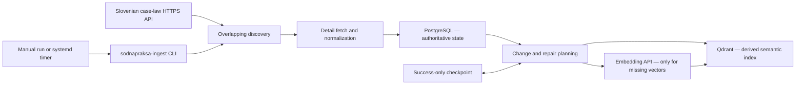

# OpenLegalCore Slovenian Case-Law Ingest

`sodnapraksa-ingest` is the Slovenian case-law ingestion component of
[OpenLegalCore](https://github.com/OpenLegalCore). It discovers records from the Slovenian
case-law portal, fetches and normalizes supported source documents, stores authoritative state in
PostgreSQL, creates deterministic semantic chunks, and maintains the derived
`sodnapraksa_current` collection in Qdrant.

It is a focused ingestion and integrity-maintenance utility. It is not a legal search interface, a
chatbot, a legal-analysis engine, or a replacement for professional verification of source
documents.

> [!IMPORTANT]
> This is an independent project. It is not an official project of the Slovenian judiciary, the
> Republic of Slovenia, or the operator of `sodnapraksa.si`. The software does not include source
> credentials, source records, court decisions, or embedding-provider access.

## Contents

- [What this component does](#what-this-component-does)
- [Current status](#current-status)
- [Quick start](#quick-start)
- [External services and credentials](#external-services-and-credentials)
- [PostgreSQL and Qdrant bootstrap](#postgresql-and-qdrant-bootstrap)
- [Installation and build](#installation-and-build)
- [Configuration](#configuration)
- [Read-only preflight](#read-only-preflight)
- [First controlled run](#first-controlled-run)
- [Nightly deployment](#nightly-deployment)
- [Advanced operations and internals](#advanced-operations-and-internals)
- [Troubleshooting](#troubleshooting)
- [Security and data responsibilities](#security-and-data-responsibilities)
- [License](#license)
- [Contributing](#contributing)

## What this component does

The normal data path is:



The component provides:

- overlapping `dateModified` discovery with complete pagination;
- detail fetch and normalization for supported `doc`, `seu`, `art`, and `inj` source routes;
- separate content and metadata hashes;
- deterministic document, chunk, and Qdrant point identities;
- conditional PostgreSQL writes without unchanged-row churn;
- embedding only for chunks that need a compatible vector;
- Qdrant vector, payload, missing-point, and stale-point repair;
- bounded document and embedding-input budgets;
- a durable success-only checkpoint and cooperative application lock.

It deliberately does **not** provide:

- PostgreSQL or Qdrant provisioning;
- source-portal or embedding-provider accounts;
- legal classification beyond fields proven by the source contract;
- a retrieval API, ranking engine, user interface, or legal advice;
- authoritative global withdrawal detection; or
- automatic unbounded historical repair.

The wider Slovenian component map is maintained in the
[`OpenLegalCore/slovenia`](https://github.com/OpenLegalCore/slovenia) architecture hub.

## Current status

- Package and release candidate: **v0.1.6**.
- Engineering status: **technically and production-path validated**.
- Publication status: **private until separately authorized**.
- License status: **source-available under BUSL-1.1 before the applicable Change Date**.

The controlled production path, local canary, deterministic idempotent rerun,
PostgreSQL/Qdrant convergence, embedding batching, and success-only checkpoint path have been
validated. This README does not claim that a post-deployment timer-triggered v0.1.6 run has
completed; natural scheduled operation remains separate operational evidence.

## Quick start

This quick start validates the program against **already compatible** PostgreSQL and Qdrant
targets. It stops at a read-only preflight. Do not run the mutating command until you have reviewed
the first-run checklist below.

### 1. Install the toolchain

You need Linux, Git, [`uv`](https://docs.astral.sh/uv/), and exactly CPython 3.12.3:

```bash
git clone https://github.com/OpenLegalCore/slovenia-sodnapraksa-ingest.git
cd slovenia-sodnapraksa-ingest
uv python install 3.12.3
uv sync --locked
uv run sodnapraksa-ingest --help
```

### 2. Create a private local environment file

```bash
cp .env.example .env.local
chmod 600 .env.local
${EDITOR:-vi} .env.local
```

`.env.local` is ignored by Git. Replace every placeholder. The application does not load dotenv
files itself, so export the reviewed values in your shell or provide them through your service
manager:

```bash
set -a
. ./.env.local
set +a
```

Keep both authorization flags at `0` during setup and preflight.

For a non-systemd local preflight, use an ignored writable state directory instead of the
production `/var/lib` and `/run` paths from the example:

```bash
mkdir -p state
export SODNAPRAKSA_CHECKPOINT_PATH="$PWD/state/checkpoint.json"
export SODNAPRAKSA_LOCK_PATH="$PWD/state/ingest.lock"
```

### 3. Verify the external targets without writes

```bash
SODNAPRAKSA_ALLOW_EXTERNAL_API=0 \
SODNAPRAKSA_ALLOW_WRITES=0 \
uv run sodnapraksa-ingest preflight
```

A successful preflight exits `0` and prints one JSON result with PostgreSQL, Qdrant, and checkpoint
status. It does not call the source API or embedding provider and does not write PostgreSQL,
Qdrant, or the checkpoint.

If it fails, correct the reported contract mismatch. Do not bypass the guard or enable writes to
test basic connectivity.

## External services and credentials

No credential is bundled with this repository, a future source distribution, a wheel, a database
snapshot, or an OpenLegalCore website.

| Dependency | Required operator action | Configuration |
| --- | --- | --- |
| Slovenian case-law source API | Obtain your own API access and key directly from the source operator under its current access procedure and terms. OpenLegalCore cannot issue, transfer, or guarantee this credential. | `SODNAPRAKSA_SOURCE_BASE_URL`, `SODNAPRAKSA_SOURCE_API_KEY` |
| Embedding API | Create and fund your own compatible embedding-provider account. The established collection contract uses `text-embedding-3-large` with 3,072 dimensions. | `SODNAPRAKSA_EMBEDDING_BASE_URL`, `SODNAPRAKSA_EMBEDDING_API_KEY` |
| PostgreSQL | Operate your own database and credentials. The DSN database must equal the explicit expected database. | `SODNAPRAKSA_DATABASE_URL`, `SODNAPRAKSA_EXPECTED_DATABASE`, `SODNAPRAKSA_EXPECTED_SCHEMA` |
| Qdrant | Operate your own compatible endpoint and collection. Supply a key only when your Qdrant deployment requires one. | `SODNAPRAKSA_QDRANT_URL`, `SODNAPRAKSA_QDRANT_API_KEY`, `SODNAPRAKSA_QDRANT_COLLECTION` |

Source access and data-use conditions are independent of the eventual software license. You are
responsible for confirming that discovery, fetch, processing, storage, redistribution, and
downstream use comply with the source operator's terms and applicable law.

## PostgreSQL and Qdrant bootstrap

### Supported starting states

The current implementation expects either:

1. an existing PostgreSQL database with the compatible case-law schema and an existing compatible
   Qdrant collection; or
2. a PostgreSQL/Qdrant state restored from a future matching `slovenia-database` snapshot release.

This repository does not currently ship schema migrations, create a database, create service
accounts, or create the Qdrant collection. Until a compatible bootstrap artifact or snapshot is
published, a completely empty deployment is **not** a supported quick-start path.

### Established Qdrant contract

The reviewed Slovenian case-law target uses:

```text
collection:  sodnapraksa_current
vector size: 3072
distance:    Cosine
model:       text-embedding-3-large
```

Unlike the PISRS component, these values are supplied through configuration. They must still match
the collection and all existing points exactly. Changing the model, dimensions, collection, or
point-identity algorithm requires a separately controlled migration or full reindex.

### Compatibility rule

Treat the software version, PostgreSQL schema, Qdrant payload/vector contract, and snapshot
manifest as one compatibility set. Run `preflight` after every restore, upgrade, endpoint change,
or credential rotation and before every first mutating run in a new environment.

## Installation and build

### Locked runtime environment

```bash
uv python install 3.12.3
uv sync --locked
```

### Locked development environment

```bash
uv sync --locked --extra dev
uv lock --check
```

Do not regenerate `uv.lock` as a side effect of installation.

### Verification

```bash
uv run --extra dev ruff format --check .
uv run --extra dev ruff check .
uv run --extra dev pytest
```

### Build wheel and source distribution

```bash
build_output="$(mktemp -d)"
uv build --out-dir "$build_output"
ls -l "$build_output"
```

Use a new output directory and verify both archives before deployment. Do not deploy a stale local
`dist/` directory.

## Configuration

Copy [`.env.example`](.env.example) to a private file outside the repository for production. Every
required value is parsed before files, network connections, or stores are opened. Placeholders are
rejected and there are no production credentials, target identities, paths, budgets, or mutation
permissions supplied by the runtime.

| Variable | Purpose |
| --- | --- |
| `SODNAPRAKSA_DATABASE_URL` | PostgreSQL DSN. Keep it secret. |
| `SODNAPRAKSA_EXPECTED_DATABASE` | Credential-free database identity that must match the DSN. |
| `SODNAPRAKSA_EXPECTED_SCHEMA` | Expected PostgreSQL schema identifier. |
| `SODNAPRAKSA_SOURCE_BASE_URL` | Credential-free HTTPS source API base URL. |
| `SODNAPRAKSA_SOURCE_API_KEY` | Private source API key. |
| `SODNAPRAKSA_QDRANT_URL` | Qdrant HTTPS URL, or loopback HTTP URL for local operation. |
| `SODNAPRAKSA_QDRANT_API_KEY` | Optional private Qdrant key; leave empty only when the target requires none. |
| `SODNAPRAKSA_QDRANT_COLLECTION` | Exact derived collection identity. |
| `SODNAPRAKSA_EMBEDDING_BASE_URL` | Credential-free HTTPS embedding endpoint. |
| `SODNAPRAKSA_EMBEDDING_API_KEY` | Private embedding-provider key. |
| `SODNAPRAKSA_EMBEDDING_MODEL` | Exact embedding model associated with the collection. |
| `SODNAPRAKSA_EMBEDDING_DIMENSIONS` | Positive vector dimension, maximum 65,536. |
| `SODNAPRAKSA_CHECKPOINT_PATH` | Absolute path to the durable checkpoint JSON. |
| `SODNAPRAKSA_LOCK_PATH` | Different absolute path for the application lock. |
| `SODNAPRAKSA_INITIAL_SINCE` | Timezone-aware initial UTC boundary used before a checkpoint exists. |
| `SODNAPRAKSA_OVERLAP_DAYS` | Positive overlap, maximum 31 days. |
| `SODNAPRAKSA_DISCOVERY_LIMIT` | Positive bound on timestamp-admitted listing candidates scanned in one run. |
| `SODNAPRAKSA_DOCUMENT_LIMIT` | Positive bound on candidates that require a source detail request. |
| `SODNAPRAKSA_MAX_EMBEDDING_INPUT_BYTES_PER_RUN` | Positive UTF-8 byte cap for all new-vector input in one run. |
| `SODNAPRAKSA_ALLOW_EXTERNAL_API` | Strict `0` or `1`; mutating `run` requires `1`. |
| `SODNAPRAKSA_ALLOW_WRITES` | Strict `0` or `1`; mutating `run` requires `1`. |

`preflight` requires both flags to be `0`. `run` requires both to be `1`.

Never put secrets, DSNs, private endpoints, source records, or unredacted operational output in
Git, command-line arguments, screenshots, issue reports, CI output, or logs.

## Read-only preflight

Run preflight whenever configuration or infrastructure changes:

```bash
SODNAPRAKSA_ALLOW_EXTERNAL_API=0 \
SODNAPRAKSA_ALLOW_WRITES=0 \
uv run sodnapraksa-ingest preflight
```

It validates and reads:

- all required configuration and authorization flags;
- the application lock;
- PostgreSQL database, schema, and expected target contract;
- Qdrant collection and vector contract; and
- checkpoint state.

It does not contact the source API or embedding provider and performs no PostgreSQL, Qdrant, or
checkpoint write.

Success exits `0` and returns JSON in this shape:

```json
{
  "mode": "preflight",
  "result": {
    "checkpoint_end": "...",
    "postgres": {},
    "qdrant": {}
  },
  "status": "ok"
}
```

The exact nested values depend on the reviewed target state.

## First controlled run

Do not make the first mutation through an unattended timer.

### Before the run

1. Record the exact Git commit or verified wheel hash.
2. Back up or snapshot PostgreSQL, Qdrant, and the checkpoint.
3. Confirm that no legacy or competing case-law ingest is running.
4. Confirm the shared application lock path and ownership.
5. Review the overlap, document limit, and embedding-byte cap.
6. Run read-only preflight and independently record baseline counts and identities.
7. Confirm source and embedding quotas, expected cost, and the selected fixed interval.

### Optional deterministic interval in an isolated or recovery environment

```bash
# Replace this example with the reviewed interval end.
run_end_utc="2026-08-18T00:00:00Z"
SODNAPRAKSA_ALLOW_EXTERNAL_API=1 \
SODNAPRAKSA_ALLOW_WRITES=1 \
uv run sodnapraksa-ingest run --end "$run_end_utc"
```

`--end` must be timezone-aware and not in the future. It uses the same checkpointed execution path;
it does not bypass checkpoint or safety contracts.

### Supervised production-path run

After isolated acceptance and a fresh preflight, run the installed service manually while the
timer remains disabled:

```bash
sudo systemctl start sodnapraksa-ingest.service
sudo systemctl status sodnapraksa-ingest.service
sudo journalctl -u sodnapraksa-ingest.service --no-pager
```

The run can contact the source and embedding APIs, write PostgreSQL and Qdrant, delete only planned
stale derived points, and advance the checkpoint after complete success.

### Verify the result

Repeat read-only preflight and independently compare:

- PostgreSQL document/chunk counts, maxima, duplicates, and unfinished state;
- Qdrant health, collection contract, expected/missing/orphan/stale points, and payload types;
- checkpoint before/after values;
- embedding request count, byte input, retries, and cost;
- source request/retry behavior; and
- remaining processes, transient units, and held locks.

The same bounded interval should converge without unnecessary embeddings, inserts, timestamp churn,
or duplicate point identities.

## Nightly deployment

The tracked files in [`deploy/systemd/`](deploy/systemd/) are reviewed templates, not an
installer. Adapt identity, paths, dependency readiness, hardening, and local service policy before
copying them to `/etc/systemd/system/`.

The documented layout is:

```text
/opt/sodnapraksa-ingest/              installed immutable candidate
/opt/sodnapraksa-ingest/.venv/        installed runtime environment
/etc/sodnapraksa-ingest.env           root-owned environment, mode 0600
/var/lib/sodnapraksa-ingest/          checkpoint state
/run/sodnapraksa-ingest/              application lock
```

The service runs as the dedicated `sodnapraksa-ingest` user and group. Systemd creates the state
and runtime directories; the environment file must retain the matching absolute checkpoint and
lock paths.

The timer runs every day at **04:30 Europe/Ljubljana**, 90 minutes after the PISRS timer. It uses
`Persistent=true` and has no random delay.

Enable the timer only after:

1. a supervised service start exits successfully;
2. the complete post-run audit passes; and
3. the legacy scheduler has been handled under its separately approved cutover plan.

```bash
sudo systemctl daemon-reload
sudo systemctl start sodnapraksa-ingest.service
# Audit before enabling the timer.
sudo systemctl enable --now sodnapraksa-ingest.timer
sudo systemctl list-timers sodnapraksa-ingest.timer
```

Timer activation, the next scheduled trigger, and post-run integrity must be checked separately
after deployment. This documentation does not treat a manual run as evidence that a later natural
timer-triggered run completed.

## Advanced operations and internals

### Command reference

```bash
sodnapraksa-ingest --help
sodnapraksa-ingest preflight
sodnapraksa-ingest run
sodnapraksa-ingest run --end UTC_TIMESTAMP
```

### Source contract

The client uses:

```text
GET /api2/mainSearchFull/
GET /api2/show/{unid}/
```

Discovery is zero-based and sends day-granularity date parameters, then enforces an exact UTC
`[start, end)` test against returned `dateModified`. Because the portal filters are not treated as
a proven monotonic change feed, every next interval overlaps the last successful end by the
configured number of days.

Supported source routes are `doc`, `seu`, `art`, and `inj`. These route-local values are preserved;
they are not invented semantic legal classifications. In particular, `art` is a mixed route, not
a guarantee that every record is legal literature.

Discovery reads at most `discovery_limit + 1`; the extra record blocks the run before PostgreSQL
lookup, detail fetch, or writes rather than silently truncating the interval. PostgreSQL metadata
is then loaded in one bounded batch. A same-or-newer complete stored version is reconstructed from
its authoritative stored source body and checked against Qdrant without another source detail
request. Missing, newer, incomplete, failed, malformed, or ambiguous rows require source detail
and count toward `document_limit`; exceeding that limit blocks the run before the first detail.

### Identities, content, and metadata

```text
document_id = registryNumber = evidencna_stevilka
internal_id = numeric suffix of unid
chunk_hash  = sha256(canonical chunk text)
chunk_id    = sha256(document_id + "|" + section + "|" + index + "|" + chunk_hash)
point_id    = UUIDv5(NAMESPACE_URL, "lexai:sodnapraksa:" + chunk_id)
```

Chunks cover `jedro`, `izrek`, and `obrazlozitev` with deterministic 3,500-character boundaries
and 400-character overlap. `content_hash` covers normalized semantic sections;
`metadata_hash` separately covers identity, court, dates, legal metadata, relations, and attachment
signals. A metadata-only change updates PostgreSQL and Qdrant payload without requesting a new
embedding.

PostgreSQL is authoritative. Qdrant is derived and repairable. There is no cross-system
transaction; if PostgreSQL commits and a later derived-index operation fails, the overlapping
rerun compares both stores and converges.

### Retry, budgets, and checkpoint

Source and Qdrant retry is limited to timeouts, connection failures, `429`, and
`500/502/503/504`, with three attempts and bounded exponential backoff. Embedding POST requests
contain at most 32 inputs and make one attempt. Permanent `4xx`, malformed JSON, parsing,
configuration, and target-contract errors are not retried.

Before the first embedding request or Qdrant mutation, the program reconstructs or fetches and
normalizes the complete bounded interval, calculates all missing compatible vectors, and enforces
the configured UTF-8 embedding-input cap. Limit failure produces no embedding request, store write,
or checkpoint advance.

The checkpoint starts each next interval at the last fully successful end minus the configured
overlap, bounded by `SODNAPRAKSA_INITIAL_SINCE`. It advances only after every document and derived
operation succeeds and is replaced through file `fsync`, atomic rename, and directory `fsync`.

### Exit codes

| Code | Meaning |
| --- | --- |
| `0` | Successful command. |
| `1` | Runtime or ingest failure. |
| `75` | Application lock is already held. |
| `78` | Invalid or unsafe configuration. |

## Troubleshooting

| Symptom | Meaning and next action |
| --- | --- |
| `configuration_error` / exit `78` | A required value is absent, still a placeholder, or violates a target contract. Correct the private environment file. |
| `locked` / exit `75` | Another invocation owns the application lock. Find the process; do not infer ownership from file existence alone. |
| Checkpoint does not advance | Expected after any incomplete run. Preserve evidence, correct the root cause, and rerun the same bounded path. |
| Qdrant mismatch or missing point | Confirm model, dimensions, collection, point identity, and PostgreSQL authority before repair. |
| Unexpectedly high embedding plan | Stop before enabling writes; inspect changed content, model compatibility, overlap, and byte cap. |
| Source interval seems incomplete | Absence is not withdrawal evidence. Verify source behavior; do not infer deletion from a change interval. |

Do not publish source records, court documents, personal data, credentials, embedding inputs,
authorization headers, private endpoints, database dumps, or unredacted operational logs in a
GitHub issue.

## Security and data responsibilities

- Keep source, embedding, PostgreSQL, and Qdrant credentials outside Git with least privilege.
- Keep TLS verification enabled; non-TLS service endpoints are accepted only on loopback.
- Treat source documents and derived text as potentially sensitive even when the source is public.
- Review parsing, hashes, SQL, point identities, payloads, retry behavior, dependency locks, and
  deletion plans as data-integrity-sensitive changes.
- Keep both authorization flags at `0` except for a specifically approved mutating invocation.
- Back up authoritative state and test restoration before relying on unattended operation.
- Confirm source terms and downstream legal/data obligations independently of this software.
- Report suspected vulnerabilities privately through an established OpenLegalCore contact channel;
  do not publish sensitive details before coordinated contact is confirmed.

## License

Copyright (c) 2026 Rajko Majcen.

Version 0.1.6 is licensed under the Business Source License 1.1 (`BUSL-1.1`) until its Change
Date. It is source-available before that date and **not an Open Source license**.

Only production uses expressly granted in the complete [`LICENSE`](LICENSE) are permitted without
a separate written commercial license. In summary, the Additional Use Grant permits limited free
production use by natural persons acting solely for personal, nonprofessional, and noncommercial
purposes and by qualifying private, independent, nongovernmental nonprofit or charitable
organizations acting solely for their noncommercial public-benefit mission. It excludes the users
and uses specified in the license, including businesses, professional legal users, public-sector
and publicly controlled entities, paid products and services, SaaS, hosted or managed offerings,
white-label offerings, resale, and other commercial exploitation.

Production use outside the Additional Use Grant requires a separate written license. Contact
`sales@openlegalcore.org`.

The Change Date is four years from the first publicly available distribution of this specific
version. At that time, the version becomes available under the future Change License, Apache
License 2.0.

This is only a plain-language summary. The complete [`LICENSE`](LICENSE) is legally controlling and
prevails over this README. The software license does not grant rights to source credentials,
source data, court decisions, judicial text, third-party services, personal data, or OpenLegalCore
trademarks.

## Contributing

External contributions are not currently accepted without an approved contributor license
agreement. See [`CONTRIBUTING.md`](CONTRIBUTING.md).
